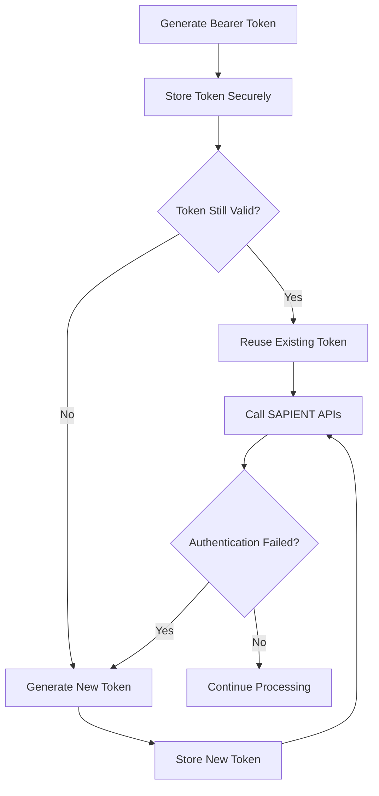

To ensure optimal performance and reduce unnecessary authentication traffic, you should store and reuse valid bearer tokens rather than generating a new token before every API request.&#x20;

Several internal integration designs and authentication implementations used within SAPIENT follow this approach by storing access tokens and refreshing them only when they expire or become invalid.

## Authentication flow

