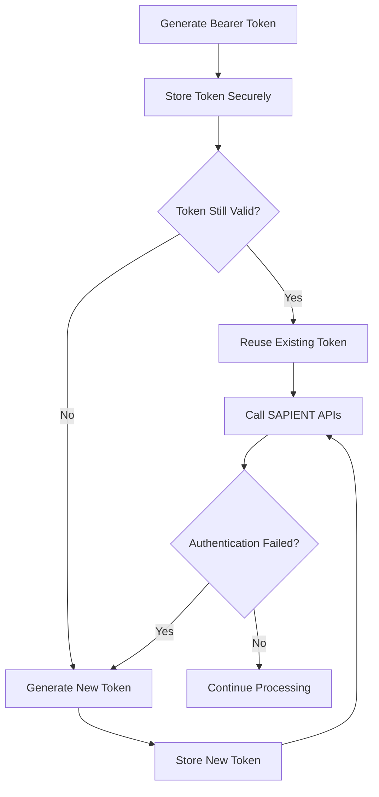

Store and reuse a valid bearer token to authenticate SAPIENT application programming interface (API) requests without generating a new token for every call.

## Manage your token

1. Generate a bearer token using your API credentials, then store the token and its returned expiry information securely.
2. Before each API request, check whether the stored token is still valid. If it is, reuse it in the **Authorization** header.
3. When the token expires or becomes invalid, generate a replacement and store it with its expiry information before making further requests.

## Authentication flow

Follow the decision path to reuse a valid token or replace one that is no longer valid.

## Track token expiry

Monitor the expiry information returned by the authentication endpoint. Request a replacement before the stored token expires so your next API request uses a valid token.

## Handle authentication failures

Authentication can fail if the token has expired or been revoked, or if the credentials are invalid. If an API request fails authentication:

1. Check whether the stored token has expired or is no longer valid.
2. If it is, generate and store a replacement token.
3. Retry the API request with the valid token.
4. If authentication still fails, check your API credential configuration.

<Callout icon="🚧" theme="warning">
  Store tokens securely. Do not generate a new token for every API request; replace a token when it expires or is no longer valid.
</Callout>

## Common authentication mistakes

| Avoid | Recommended |
| :--- | :--- |
| Generating a token before every API request. | Reuse a valid stored token. |
| Ignoring token expiry. | Track expiry and replace the token before it expires. |
| Storing credentials in source code. | Store credentials securely. |
| Ignoring authentication failures. | Check token validity, retry with a valid token and investigate persistent failures. |

## Next steps

Once you have stored a valid token, you can make authenticated SAPIENT API requests to create shipments, generate labels, track shipments and manifest.