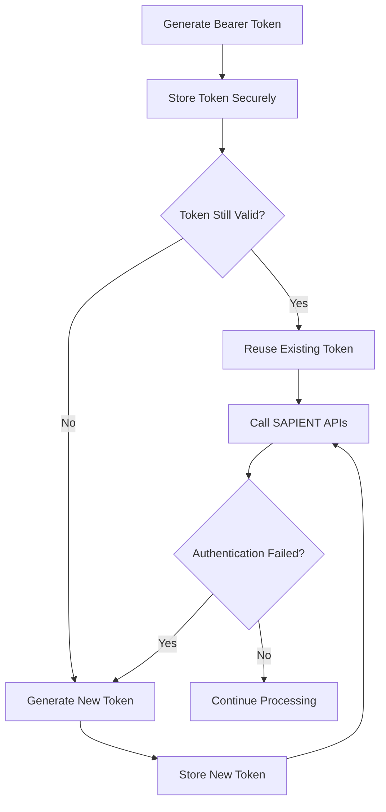

To ensure optimal performance and reduce unnecessary authentication traffic, you should store and reuse valid bearer tokens rather than generating a new token before every API request.&#x20;

Several internal integration designs and authentication implementations used within SAPIENT follow this approach by storing access tokens and refreshing them only when they expire or become invalid.

## Authentication flow

## Track Token Expiry

Always monitor the expiry information returned by the authentication endpoint and generate a new token before the current token expires.

Several authentication implementations within Intersoft store authentication tokens together with their expiry information and only request replacement tokens when required.

## Handle Authentication Failures&#x20;

Authentication failures may occur when:

- The token has expired.
- The credentials are invalid.
- The token has been revoked.

If an authentication request fails:

- Verify the token has not expired.
- Generate a new token if required.
- Retry the API request.
- Investigate credential configuration if the issue persists.

<Callout icon="🚧" theme="warn">
  ### _Important_

  _Generate a bearer token once, store it securely, and continue using it until it expires. Only request a new token when the current token is no longer valid._
</Callout>

This approach reduces authentication overhead, improves integration performance, and aligns with common token management practices used across Intersoft integrations where valid access tokens are stored, reused, and refreshed only when necessary.
