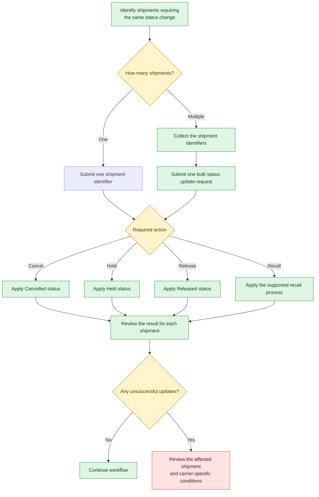

Choose whether to submit one shipment identifier or a supported bulk status update request, then check the result for each shipment.

## Choose your request

Use the number of shipments requiring the same status change to select a path:

<Columns layout="auto">
  <Column>
    ### One shipment

    Submit one shipment identifier for the required action.
  </Column>

  <Column>
    ### Multiple shipments

    Collect the eligible shipment identifiers and submit them in one supported bulk status update request for the same action.
  </Column>
</Columns>

## Follow the status update flow

The diagram shows the available action paths—cancel, hold, release and the supported recall process—and how to review their results.

## Review the results

1. Check the response for the outcome of each shipment identifier.
2. If any update was unsuccessful, review the affected shipment and any carrier-specific conditions before continuing the workflow.
3. Continue the workflow when there are no unsuccessful updates.

<Callout icon="far fa-circle-info" theme="info">
  ### _Note_

  _Use a bulk status update only where the operation supports multiple shipments._
</Callout>
