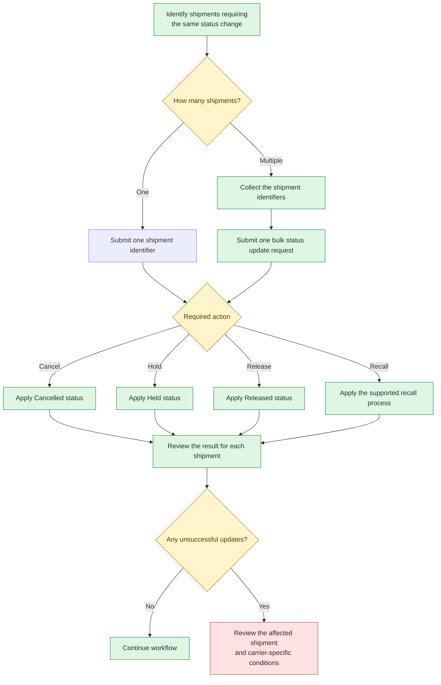

When the same action needs to be applied to multiple shipments, processing them individually can increase the number of API requests and add unnecessary complexity to your workflow. Where supported, SAPIENT allows you to update multiple shipments in a single operation, making shipment management more efficient and reducing processing time.

This approach is particularly useful when large groups of shipments need to be cancelled, held, released, or otherwise updated as part of the same business process. Instead of performing the same action repeatedly for each shipment, you can submit a single request containing all applicable shipment identifiers and review the outcome for each shipment in the response.

The following workflow demonstrates how to determine when a bulk status update should be used and outlines the recommended process for updating multiple shipments efficiently.

