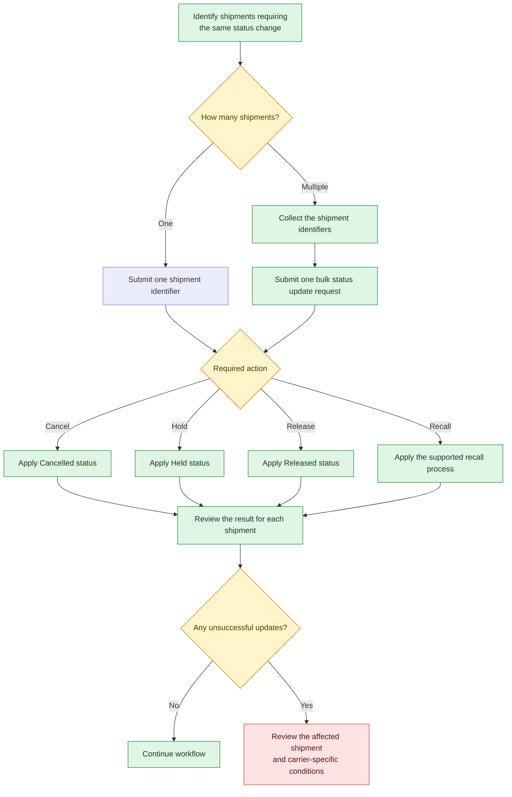

 

```mermaid
flowchart TD
    A["Identify shipments requiring<br/>the same status change"] --> B{How many shipments?}

    B -->|One| C[Submit one shipment identifier]
    B -->|Multiple| D[Collect the shipment identifiers]
    D --> E[Submit one bulk status update request]

    C --> F{Required action}
    E --> F

    F -->|Cancel| G[Apply Cancelled status]
    F -->|Hold| H[Apply Held status]
    F -->|Release| I[Apply Released status]
    F -->|Recall| J[Apply the supported recall process]

    G --> K[Review the result for each shipment]
    H --> K
    I --> K
    J --> K

    K --> L{Any unsuccessful updates?}
    L -->|No| M[Continue workflow]
    L -->|Yes| N["Review the affected shipment<br/>and carrier-specific conditions"]

    classDef bulk fill:#dff6e4,stroke:#16823b,color:#123b1e;
    classDef decision fill:#fff4cc,stroke:#b58100,color:#4d3900;
    classDef review fill:#ffe2e2,stroke:#c53d3d,color:#571515;

    class A,D,E,G,H,I,J,K,M bulk;
    class B,F,L decision;
    class N review;
```
