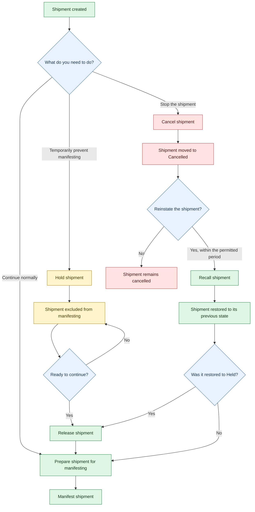

After a shipment has been created, there may be situations where its status needs to be updated before it can be manifested or handed over to the carrier. SAPIENT provides several shipment management actions that allow you to control how a shipment progresses through the fulfilment process, including placing shipments on hold, releasing held shipments, cancelling shipments, and recalling previously cancelled shipments.

Understanding how these actions affect the shipment lifecycle is important, as certain statuses can prevent a shipment from being manifested until further action is taken. For example, shipments placed on hold must be released before they become eligible for manifesting.

The following workflow illustrates the relationship between the available shipment status actions and shows how shipments can move between the various states before continuing through the shipment lifecycle.

##  Behaviour to explain below the flow

- Held shipments are excluded from manifesting. They must be released before they can be manifested. The manifest status filter supports Picked; without that filter, matching Picked or LabelPrinted shipments are included, but held shipments remain excluded.
- Releasing a shipment removes it from hold so that it can be closed out. Multiple held shipments can be selected and released together through the UI.
- Cancelled shipments can be recalled within the first 24 hours. A recalled shipment is restored to its previous processed or unprocessed state.&#x20;
- If a shipment was cancelled while held and then recalled, it returns to the held status. It must therefore be released before manifesting.
