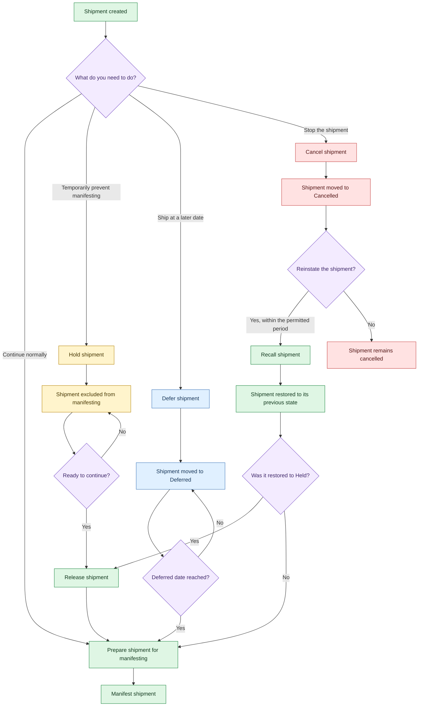

Manage a shipment after creation by choosing whether to hold, release, defer, cancel or recall it before manifesting.

## Choose a status action

Select the action that matches what you need to do with the shipment:

<Cards>
  <Card title="Hold shipment" href="/docs/held-shipments" icon="fa-pause-circle">
    Temporarily exclude a shipment from manifesting until you release it.
  </Card>

  <Card title="Release shipment" href="/docs/release-shipment" icon="fa-play-circle">
    Remove a shipment from hold so it can proceed towards manifesting.
  </Card>

  <Card title="Defer shipment" href="/docs/defer-shipments" icon="fa-clock">
    Move a shipment to a later date when it cannot ship immediately.
  </Card>

  <Card title="Cancel shipment" href="/docs/view-cancelled-shipments" icon="fa-ban">
    Stop a shipment and move it to **Cancelled**.
  </Card>

  <Card title="Recall shipment" href="/docs/recall-shipment" icon="fa-undo">
    Reinstate a cancelled shipment within the first 24 hours.
  </Card>
</Cards>

## Follow the status flow

Use the diagram to see how each action affects the shipment's path to manifesting.

## Manifesting and recall rules

- **Held shipments:** Held shipments are excluded from manifesting. Release them before manifesting. The manifest status filter supports **Picked**; without that filter, matching **Picked** or **LabelPrinted** shipments are included, but held shipments remain excluded.
- **Bulk release:** You can select and release multiple held shipments together in the user interface (UI) so they can be closed out.
- **Recall period:** You can recall a cancelled shipment within the first 24 hours. Recall restores its previous processed or unprocessed state.
- **Recall of a held shipment:** A shipment cancelled while on hold returns to **Held** when recalled. Release it before manifesting.