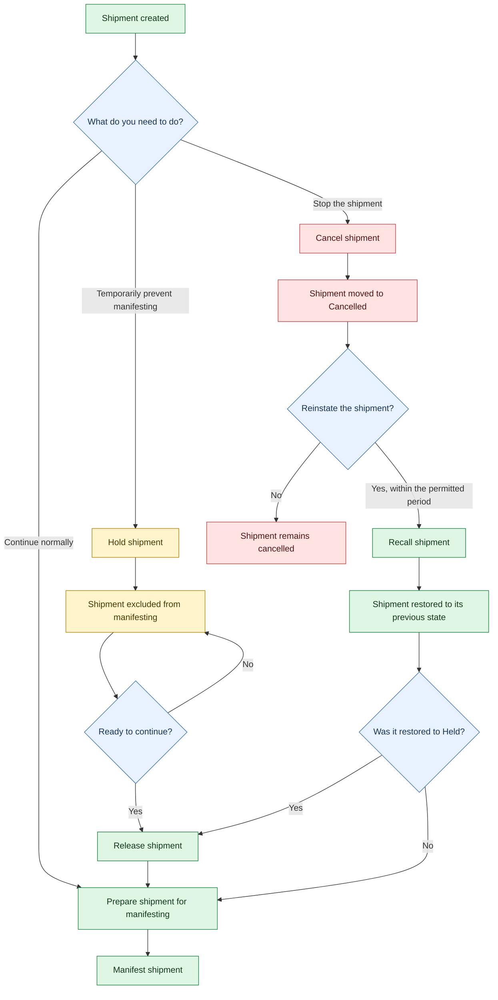

 

```mermaid
flowchart TD
    A[Shipment created] --> B{What do you need to do?}

    B -->|Continue normally| C[Prepare shipment for manifesting]

    B -->|Temporarily prevent manifesting| D[Hold shipment]
    D --> E[Shipment excluded from manifesting]
    E --> F{Ready to continue?}
    F -->|Yes| G[Release shipment]
    G --> C
    F -->|No| E

    B -->|Stop the shipment| H[Cancel shipment]
    H --> I[Shipment moved to Cancelled]
    I --> J{Reinstate the shipment?}
    J -->|Yes, within the permitted period| K[Recall shipment]
    K --> L[Shipment restored to its previous state]
    L --> M{Was it restored to Held?}
    M -->|Yes| G
    M -->|No| C
    J -->|No| N[Shipment remains cancelled]

    C --> O[Manifest shipment]

    classDef happy fill:#dff6e4,stroke:#16823b,color:#123b1e;
    classDef hold fill:#fff4cc,stroke:#b58100,color:#4d3900;
    classDef cancel fill:#ffe2e2,stroke:#c53d3d,color:#571515;
    classDef decision fill:#e8f1ff,stroke:#3973b8,color:#17365d;

    class A,C,G,K,L,O happy;
    class D,E hold;
    class H,I,N cancel;
    class B,F,J,M decision;
```
