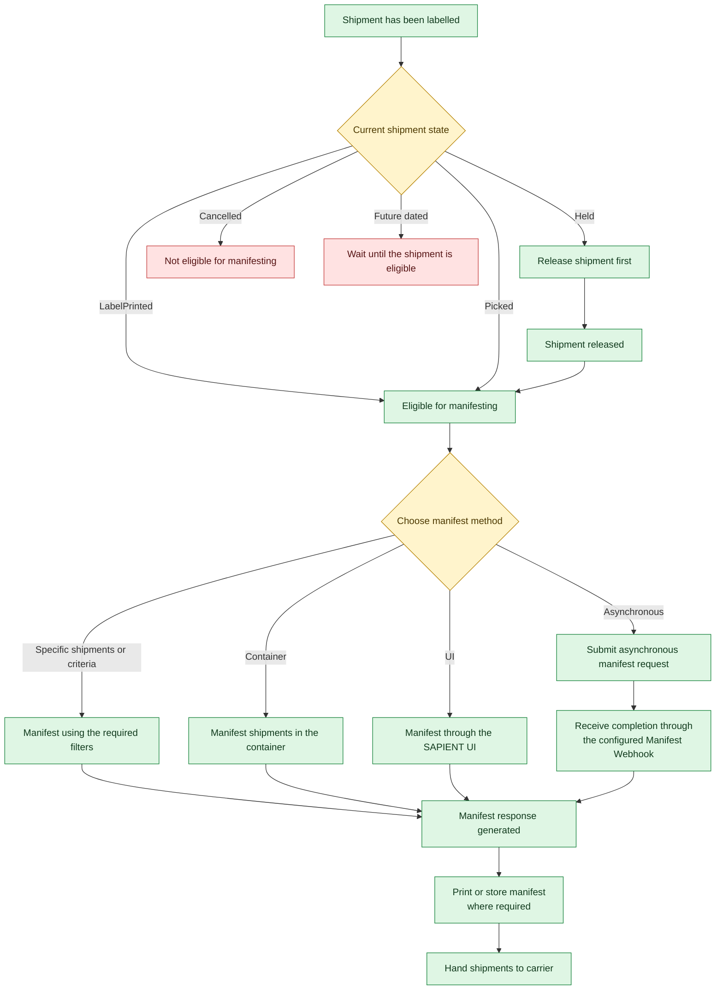

Check whether a labelled shipment is eligible for manifesting, then choose how to submit it for carrier handover.

## Check shipment readiness

Use the shipment's current state to decide what to do next:

| Shipment state | Next step |
| :--- | :--- |
| **LabelPrinted** or **Picked** | You can proceed to a manifesting method. |
| **Held** | Release the shipment before manifesting. |
| **Cancelled** | Do not include the shipment in a manifest. |
| **Future-dated** | Wait until the shipment is eligible. |

If the shipment does not have a label, generate one before following the readiness flow.

## Choose a manifesting method

Choose the path that matches how you want to select and submit shipments:

<Cards>
  <Card title="Manifest by Picked status" href="/docs/manifest-shipments-by-picked-status" icon="fa-check-circle">
    Select shipments with **Picked** status.
  </Card>
  <Card title="Manifest in a container" href="/docs/manifest-shipments-in-a-container" icon="fa-box">
    Manifest shipments assigned to a container.
  </Card>
  <Card title="Manifest asynchronously" href="/docs/manifest-shipments-asychronously" icon="fa-clock">
    Submit an asynchronous request and receive completion through the configured manifest webhook.
  </Card>
  <Card title="Manifest through the SAPIENT UI" href="/docs/manifesting-shipments" icon="fa-desktop">
    Use the user interface (UI) to manifest shipments.
  </Card>
</Cards>

<Callout icon="🚧" theme="warning">
  You can manifest by container, **Picked** status, shipping location, shipping account or service code. If you supply no manifest parameters, shipments in **LabelPrinted** or **Picked** status are manifested, excluding future-dated shipments and those assigned to a container. Configure the manifest webhook before using asynchronous manifesting.
</Callout>

## Follow the readiness flow

Use the diagram to trace a shipment from its current state through manifesting and carrier handover.

