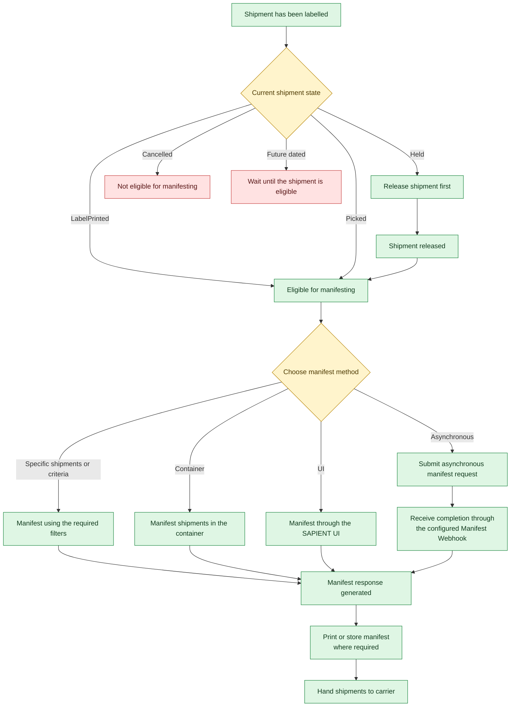

Before a shipment can be manifested, it must meet the required criteria for the selected manifesting method. Depending on how the shipment was created and processed, certain actions may need to be completed first, such as generating labels, releasing held shipments, or resolving shipment status issues.

Understanding what makes a shipment eligible for manifesting helps prevent failed manifest requests and ensures shipments are included in the correct manifest. This is particularly important when working with different creation actions, shipment statuses, containers, or asynchronous manifesting processes.

<Callout icon="🚧" theme="warn">
  ### _Important_

  _Shipments may be manifested by container, Picked status, shipping location, shipping account or service code. If no manifest parameters are supplied, shipments in LabelPrinted or Picked status are manifested, excluding future-dated shipments and those assigned to a container._

  _For asynchronous manifesting, the manifest webhook must be configured before using that workflow\._
</Callout>

The following workflow illustrates the key checks and decision points that determine whether a shipment is ready for manifesting and the available paths for submitting shipments to the carrier.

