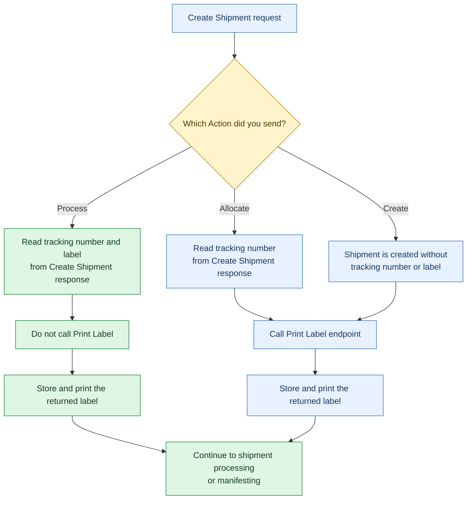

Choosing the correct action is important for optimising your integration and avoiding unnecessary processing steps. For example, when using the Process action, tracking numbers and labels are returned directly in the Create Shipment response, making additional label generation requests unnecessary. In contrast, the Create and Allocate actions require further processing before the shipment is ready for manifesting.

The following decision flow helps you determine the expected outcome of each shipment action and identifies when the Print Label API should be used. It also highlights the recommended processing path for each action so that shipments can progress efficiently through the shipment lifecycle.

