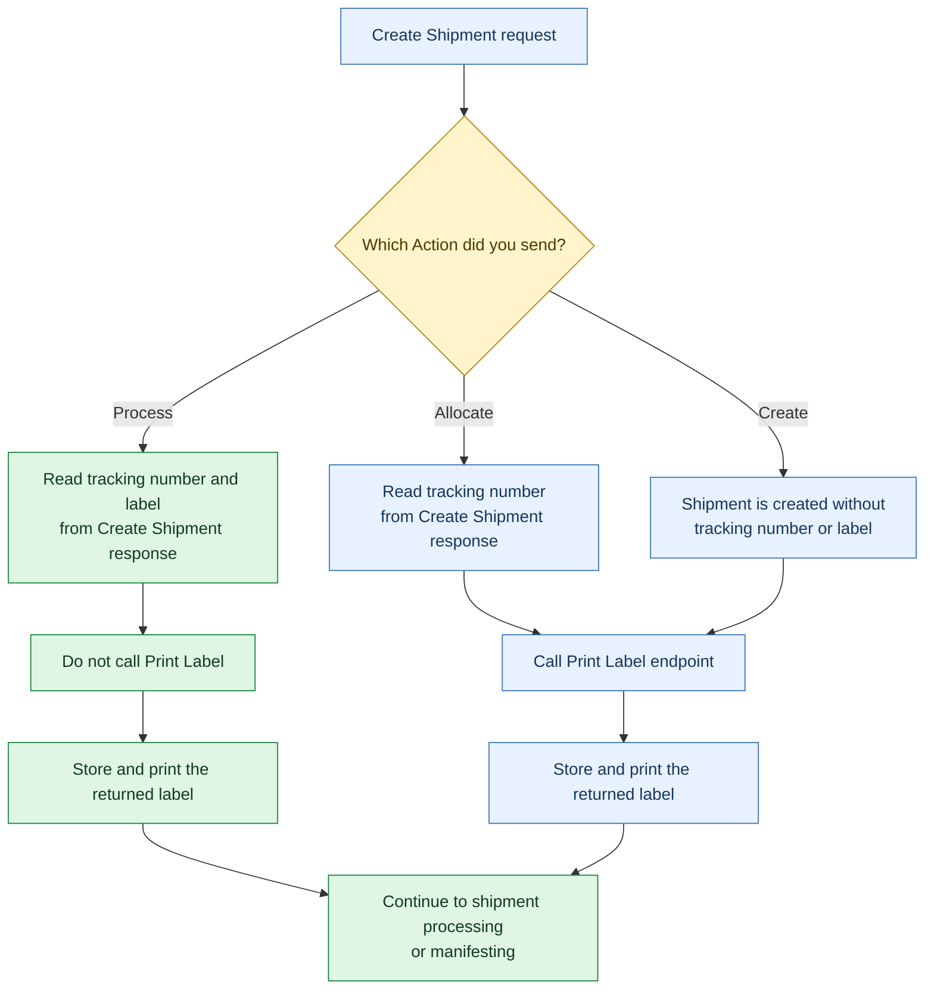

Choose the **Action** for your Create Shipment request and determine whether you need to call the Print Label application programming interface (API) before processing or manifesting the shipment.

## Choose your action

Use these paths to identify what the Create Shipment response contains and what to do next:

<Cards columns="3">
  <Card title="Process" href="/docs/create-shipment-with-action-process" icon="fa-check-circle">
    The response includes a tracking number and label. Store and print the returned label; do not call Print Label.
  </Card>

  <Card title="Allocate" href="/docs/create-shipments-with-action-allocate" icon="fa-barcode">
    The response includes a tracking number, but no label. Call Print Label, then store and print the returned label.
  </Card>

  <Card title="Create" href="/docs/create-shipments-with-action-create" icon="fa-box">
    The shipment has no tracking number or label. Call Print Label, then store and print the returned label.
  </Card>
</Cards>

## Follow the decision flow

Follow your **Action** path from the Create Shipment request to shipment processing or manifesting.

<Callout icon="🚧" theme="warning">
  ### _Important_

  _When&#x20;_**_Action_**_&#x20;is&#x20;_**_Process_**_, use the label from the Create Shipment response. Do not call&#x20;_**_Print Label_**_&#x20;for the same shipment. Call&#x20;_**_Print Label_**_&#x20;when you used&#x20;_**_Create_**_&#x20;or&#x20;_**_Allocate_**_._
</Callout>
