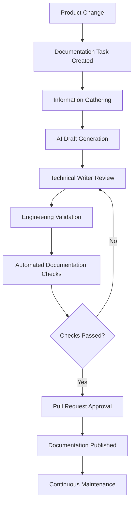

## End-to-End Documentation Lifecycle

Documentation must evolve alongside the product, not at the end of the development process.  Similar to the Software Development Lifecycle (SDLC), the content generation must also follow the Document Development Lifecycle (DDLC).  This approach integrates documentation into the software development lifecycle (SDLC) using Docs-as-Code principles and AI-assisted automation.

This section provides information that ensures documentation remains accurate, reviewable, version-controlled, and ready at the time of production release. You will use this lifecycle to create, validate, publish, and maintain documentation alongside each product change

<Callout icon="fa-solid fa-user-check" theme="info">
  ### _Note_

  _AI can draft structure, explanations, examples, and troubleshooting guidance, but a human must review all AI-generated content. Do not use AI to introduce undocumented features or unverified technical details._
</Callout>

## Documentation lifecycle

<Columns layout="auto">
  <Column>

### Plan and gather

1. A product change triggers documentation work.
2. The Product Manager/Business Analyst creates a user story and engineering begins implementation.
3. Create a documentation task with the development task.
4. Gather verified technical information.

  </Column>
  <Column>

### Draft and validate

5. Generate an AI-assisted draft from the approved documentation brief.
6. Review the draft for clarity, accuracy, structure, and style.
7. Have engineering validate technical details.
8. Run automated documentation checks.

  </Column>
  <Column>

### Approve and maintain

9. Resolve pull request comments and obtain approval.
10. Publish documentation with the corresponding software release.
11. Maintain the content as the product evolves.

  </Column>
</Columns>

## Flow chart

## 1. Start from a product change

Create documentation work whenever a product change affects what users need to know or do.

<Cards columns={2}>
  <Card title="Feature and interface changes" href="#1-start-from-a-product-change" icon="fa-solid fa-code">
    Document new features, API endpoint changes, UI updates, and workflow-affecting bug fixes.
  </Card>
  <Card title="Product language and lifecycle changes" href="#1-start-from-a-product-change" icon="fa-solid fa-arrows-rotate">
    Update content for terminology changes and deprecations of existing functionality.
  </Card>
</Cards>

> **Output:** Create a documentation task alongside the development task.

## 2. Gather verified information

Build a documentation brief from trusted sources before drafting. Use the brief to confirm technical details rather than relying on assumptions.

- Review the Product Requirements Document (PRD) and engineering design documents.
- Verify API behavior in the OpenAPI or Swagger specification.
- Review UI designs in Figma and relevant developer discussions.
- Use release notes to confirm the scope of the product change.

> **Output:** A documentation brief containing verified technical information.

## 3. Create the initial draft

Use the documentation brief and approved prompts to generate the first Markdown draft. AI may create the page structure, draft explanations, produce request and response examples, and suggest troubleshooting guidance.

> **Output:** Draft Markdown documentation.

## 4. Review the draft

Have the Technical Writer review the draft before technical validation.

- Check clarity, readability, and structure.
- Confirm the content follows the style guide.
- Resolve missing or unclear details with the engineering team.

> **Output:** A revised documentation draft.

## 5. Validate technical content

Have a Software Engineer validate the draft against the implemented product.

- Confirm endpoint names, parameters, request payloads, and response examples.
- Verify authentication requirements and error codes.

**Output:** Technically approved documentation.

## 6. Run automated checks

Run documentation validation in the CI/CD pipeline before merging.

- Run Markdown linting and formatting validation.
- Detect broken links and placeholder text.
- Check terminology consistency.

<Callout icon="fa-solid fa-circle-exclamation" theme="warning">
  ### _Important_

  _Do not merge the pull request until every automated check passes._
</Callout>

## 7. Review the pull request

Review documentation through a GitHub pull request. Include the Technical Writer and Software Engineer; involve the Product Manager when required. Resolve all comments before approval.

> **Output:** An approved pull request.

## 8. Publish with the release

Publish approved content through the Docs-as-Code pipeline with the corresponding software release. Match documentation versioning to product versioning.

> **Output:** Published, release-aligned documentation.

## 9. Maintain published documentation

Keep documentation under version control after publication. Start the same workflow again when feature enhancements, customer feedback, support tickets, API changes, or product releases require an update.

## Definition of Done

Documentation is complete only when all of the following are true:

- All required pages are written.
- Engineering has validated the technical content.
- Examples have been tested.
- Terminology matches the product.
- A human has reviewed AI-generated content.
- Markdown passes automated validation.
- Peer review comments are resolved.
- The pull request is approved.
- Documentation is published with the software release.

## Quality gates

| Stage      | Quality gate                        | Owner                                                                         |
| ---------- | ----------------------------------- | ----------------------------------------------------------------------------- |
| Planning   | Documentation task created          | Product Manager or Business Analyst                                           |
| Drafting   | AI draft generated                  | Technical Writer                                                              |
| Review     | Technical accuracy verified         | Subject Matter Experts (SMEs)                                                 |
| Validation | Automated checks pass               | CI/CD pipeline (GitHub)                                                       |
| Approval   | Pull request approved               | Technical Writer                                                              |
| Publishing | Documentation released with product | Release Manager or Technical Writer when using different publishing platforms |

## Benefits

- Develop documentation in parallel with software.
- Use AI for repetitive drafting work while retaining human accountability for accuracy.
- Maintain version history and traceability with Git.
- Reduce publishing errors through automated validation.
- Prevent incomplete or inaccurate content from reaching users through defined quality gates.

 
