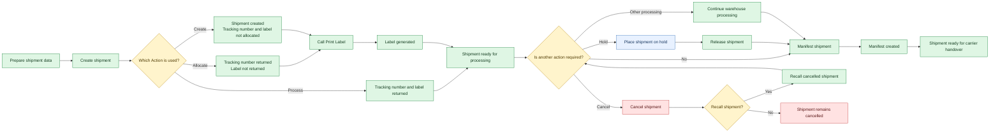

<Cards columns="4">
  <Card title="2026 release notes" href="https://docs.intersoftsapient.net/docs/2026-release-notes" icon="fa-regular fa-calendar-lines">
    Release notes for 2026.
  </Card>

  <Card title="2025 release notes" href="https://docs.intersoftsapient.net/docs/2025-release-notes" icon="fa-regular fa-calendar-lines">
    Release notes for 2025.
  </Card>

  <Card title="2024 release notes" href="https://docs.intersoftsapient.net/docs/2024-release-notes" icon="fa-regular fa-calendar-lines">
    Release notes for 2024.
  </Card>

  <Card title="2023 release notes" href="https://docs.intersoftsapient.net/docs/2023-release-notes" icon="fa-regular fa-calendar-lines">
    Release notes for 2023.
  </Card>
</Cards>

